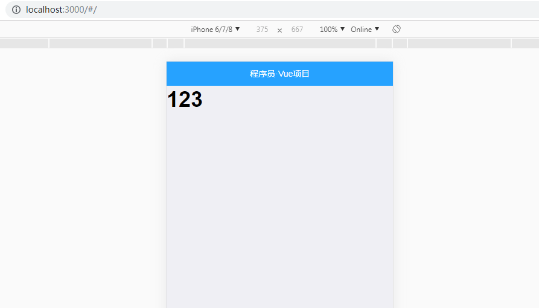

1. 使用mint-ui的header组件


1.1 首先使用mint-ui之前需要引入mint-ui的组件

```
// 按需导入 Mint-UI 中的组件   
import { Header, Swipe, SwipeItem } from 'mint-ui'
Vue.component(Header.name, Header)
```

然后在App.vue中编写header组件

```
<div class="app-container">
        <!-- 顶部 Header 区域 -->
    <mt-header fixed title="程序员·Vue项目"></mt-header>
    <h1>123</h1>
  </div>
```

观察上面的123显示,发现没有123 

可以发现123是直接顶到顶部了，可以设置padding来迫使123距离顶部一段距离，高度是header组件的高度

```
<style lang="scss" scoped>
.app-container {
  padding-top: 40px;
  overflow-x: hidden;
}
</style>

```


 


 # 制作底部的 Tabbar 区域，使用的是 MUI 的 Tabbar.html


## 引入html

原始的html

```
		<nav class="mui-bar mui-bar-tab">
			<a class="mui-tab-item mui-active" href="#tabbar">
				<span class="mui-icon mui-icon-home"></span>
				<span class="mui-tab-label">首页</span>
			</a>
			<a class="mui-tab-item" href="#tabbar-with-chat">
				<span class="mui-icon mui-icon-email"><span class="mui-badge">9</span></span>
				<span class="mui-tab-label">消息</span>
			</a>
			<a class="mui-tab-item" href="#tabbar-with-contact">
				<span class="mui-icon mui-icon-contact"></span>
				<span class="mui-tab-label">通讯录</span>
			</a>
			<a class="mui-tab-item" href="#tabbar-with-map">
				<span class="mui-icon mui-icon-gear"></span>
				<span class="mui-tab-label">设置</span>
			</a>
		</nav>
```

经过改造后的html


 ```
     <!-- 中间的 路由 router-view 区域 -->
		<transition>
			<router-view></router-view>
		</transition>


    <!-- 底部 Tabbar 区域 -->
    <nav class="mui-bar mui-bar-tab">
			<router-link class="mui-tab-item" to="/home">
				<span class="mui-icon mui-icon-home"></span>
				<span class="mui-tab-label">首页</span>
			</router-link>
			<router-link class="mui-tab-item" to="/member">
				<span class="mui-icon mui-icon-contact"></span>
				<span class="mui-tab-label">会员</span>
			</router-link>
			<router-link class="mui-tab-item" to="/shopcar">
				<span class="mui-icon mui-icon-extra mui-icon-extra-cart">
					<span class="mui-badge">0</span>
				</span>
				<span class="mui-tab-label">购物车</span>
			</router-link>
			<router-link class="mui-tab-item" to="/search">
				<span class="mui-icon mui-icon-search"></span>
				<span class="mui-tab-label">搜索</span>
			</router-link>
		</nav>
 ```

 4个跳转:

 <font color=red>
 /home
 /member
 /shopcar
 /search
</font>


##  在app.vue中间引入router-view

 ```
  <!-- 中间的 路由 router-view 区域 -->
		<transition>
			<router-view></router-view>
		</transition>
 ```

## 引入mui的扩展css
需要用到
./lib/mui/css/icons-extra.css和./lib/mui/font/mui-icons-extra.ttf
其中icons-extra.css引用了ttf

确保在main.js引入
 ```
// 导入扩展图标样式
import './lib/mui/css/icons-extra.css'
 ```


注意:
购物车小图标的样式:

```
mui-icon-extra mui-icon-extra-cart
```

 ##  创建tabar上对应的4个组件

```
src\components\tabbar\HomeContainer.vue
src\components\tabbar\MemberContainer.vue
src\components\tabbar\SearchContainer.vue
src\components\tabbar\ShopcarContainer.vue
```

HomeContainer.vue

```
<template>
  <div>
   <h1> HomeContainer.Vue </h1>
  </div>
</template>
```


MemberContainer.vue

```
<template>
  <div>
    <h1>MemberContainer.Vue</h1>
  </div>
</template>
```

 

SearchContainer.vue

```
<template>
  <div>
    <h1>SearchContainer.Vue</h1>
  </div>
</template>
```
 

ShopcarContainer.vue

```
<template>
  <div>
    <h1>ShopcarContainer.Vue</h1>
  </div>
</template>
```

## 路由高亮

```
linkActiveClass: 'mui-active' // 覆盖默认的路由高亮的类，默认的类叫做 router-link-active
```

 ##  添加路由跳转功能

 在router.js添加路由跳转

 ```
 import VueRouter from 'vue-router'

// 导入对应的路由组件
import HomeContainer from './components/tabbar/HomeContainer.vue'
import MemberContainer from './components/tabbar/MemberContainer.vue'
import ShopcarContainer from './components/tabbar/ShopcarContainer.vue'
import SearchContainer from './components/tabbar/SearchContainer.vue'

// 3. 创建路由对象
var router = new VueRouter({
  routes: [ // 配置路由规则
    { path: '/', redirect: '/home' },
    { path: '/home', component: HomeContainer },
    { path: '/member', component: MemberContainer },
    { path: '/shopcar', component: ShopcarContainer },
    { path: '/search', component: SearchContainer }
  ],
  linkActiveClass: 'mui-active' // 覆盖默认的路由高亮的类，默认的类叫做 router-link-active
})

// 把路由对象暴露出去
export default router
 ```


 ## 

 ## 添加切换tabbar的动画跳转功能


 ```
 <style lang="scss" scoped>
.app-container {
  padding-top: 40px;
  overflow-x: hidden;
}

.v-enter {
  opacity: 0;
  transform: translateX(100%);
}

.v-leave-to {
  opacity: 0;
  transform: translateX(-100%);
  position: absolute;
}

.v-enter-active,
.v-leave-active {
  transition: all 0.5s ease;
}
</style>
 ```

<font color=red>
 注意: 这里的.v-enter .v-leave-to分开配置动画
 .v-enter：在X的方向最右边以外部作为起点开始进入
 .v-leave-to:在X的方向的最左边离开

 </font>


 # 制作首页轮播图布局


