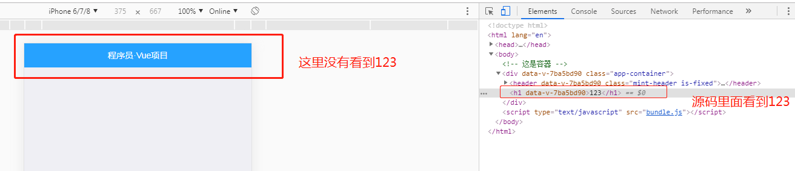
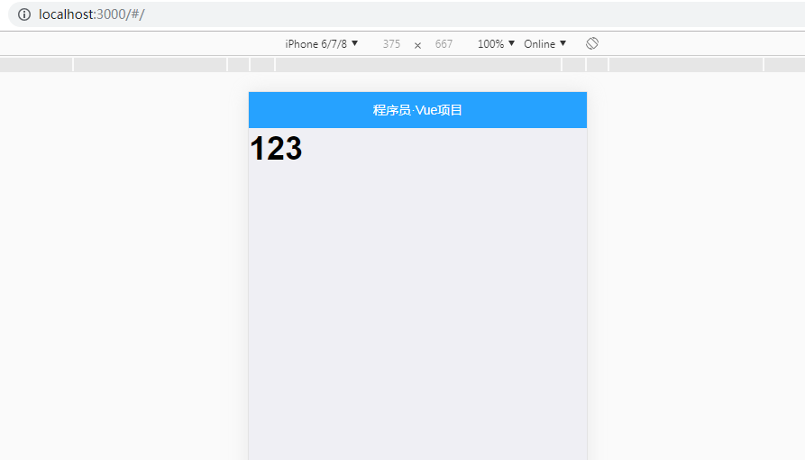
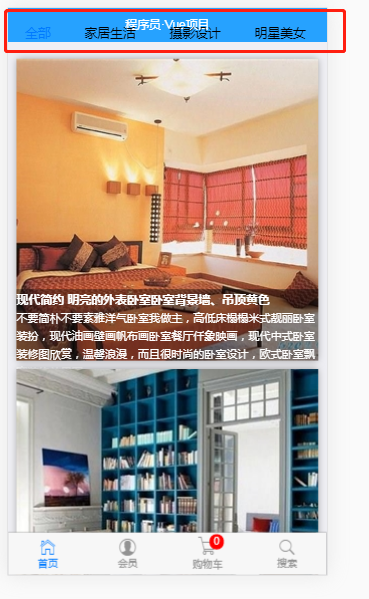

# 首页头部制作

1. 使用mint-ui的header组件


1.1 首先使用mint-ui之前需要引入mint-ui的组件

```
// 按需导入 Mint-UI 中的组件   
import { Header, Swipe, SwipeItem } from 'mint-ui'
Vue.component(Header.name, Header)
```

然后在App.vue中编写header组件

```
<div class="app-container">
        <!-- 顶部 Header 区域 -->
    <mt-header fixed title="程序员·Vue项目"></mt-header>
    <h1>123</h1>
  </div>
```

观察上面的123显示,发现没有123 

可以发现123是直接顶到顶部了，可以设置padding来迫使123距离顶部一段距离，高度是header组件的高度

```
<style lang="scss" scoped>
.app-container {
  padding-top: 40px;
  overflow-x: hidden;
}
</style>

```


 


 # 制作底部的 Tabbar 区域，使用的是 MUI 的 Tabbar.html


## 引入html

原始的html

```
		<nav class="mui-bar mui-bar-tab">
			<a class="mui-tab-item mui-active" href="#tabbar">
				<span class="mui-icon mui-icon-home"></span>
				<span class="mui-tab-label">首页</span>
			</a>
			<a class="mui-tab-item" href="#tabbar-with-chat">
				<span class="mui-icon mui-icon-email"><span class="mui-badge">9</span></span>
				<span class="mui-tab-label">消息</span>
			</a>
			<a class="mui-tab-item" href="#tabbar-with-contact">
				<span class="mui-icon mui-icon-contact"></span>
				<span class="mui-tab-label">通讯录</span>
			</a>
			<a class="mui-tab-item" href="#tabbar-with-map">
				<span class="mui-icon mui-icon-gear"></span>
				<span class="mui-tab-label">设置</span>
			</a>
		</nav>
```

经过改造后的html


 ```
     <!-- 中间的 路由 router-view 区域 -->
		<transition>
			<router-view></router-view>
		</transition>


    <!-- 底部 Tabbar 区域 -->
    <nav class="mui-bar mui-bar-tab">
			<router-link class="mui-tab-item" to="/home">
				<span class="mui-icon mui-icon-home"></span>
				<span class="mui-tab-label">首页</span>
			</router-link>
			<router-link class="mui-tab-item" to="/member">
				<span class="mui-icon mui-icon-contact"></span>
				<span class="mui-tab-label">会员</span>
			</router-link>
			<router-link class="mui-tab-item" to="/shopcar">
				<span class="mui-icon mui-icon-extra mui-icon-extra-cart">
					<span class="mui-badge">0</span>
				</span>
				<span class="mui-tab-label">购物车</span>
			</router-link>
			<router-link class="mui-tab-item" to="/search">
				<span class="mui-icon mui-icon-search"></span>
				<span class="mui-tab-label">搜索</span>
			</router-link>
		</nav>
 ```

 4个跳转:

 <font color=red>
 /home
 /member
 /shopcar
 /search
</font>


##  在app.vue中间引入router-view

 ```
  <!-- 中间的 路由 router-view 区域 -->
		<transition>
			<router-view></router-view>
		</transition>
 ```

## 引入mui的扩展css
需要用到
./lib/mui/css/icons-extra.css和./lib/mui/font/mui-icons-extra.ttf
其中icons-extra.css引用了ttf

确保在main.js引入
 ```
// 导入扩展图标样式
import './lib/mui/css/icons-extra.css'
 ```


注意:
购物车小图标的样式:

```
mui-icon-extra mui-icon-extra-cart
```

 ##  创建tabar上对应的4个组件

```
src\components\tabbar\HomeContainer.vue
src\components\tabbar\MemberContainer.vue
src\components\tabbar\SearchContainer.vue
src\components\tabbar\ShopcarContainer.vue
```

HomeContainer.vue

```
<template>
  <div>
   <h1> HomeContainer.Vue </h1>
  </div>
</template>
```


MemberContainer.vue

```
<template>
  <div>
    <h1>MemberContainer.Vue</h1>
  </div>
</template>
```

 

SearchContainer.vue

```
<template>
  <div>
    <h1>SearchContainer.Vue</h1>
  </div>
</template>
```
 

ShopcarContainer.vue

```
<template>
  <div>
    <h1>ShopcarContainer.Vue</h1>
  </div>
</template>
```

## 路由高亮

```
linkActiveClass: 'mui-active' // 覆盖默认的路由高亮的类，默认的类叫做 router-link-active
```

 ##  添加路由跳转功能

 在router.js添加路由跳转

 ```
 import VueRouter from 'vue-router'

// 导入对应的路由组件
import HomeContainer from './components/tabbar/HomeContainer.vue'
import MemberContainer from './components/tabbar/MemberContainer.vue'
import ShopcarContainer from './components/tabbar/ShopcarContainer.vue'
import SearchContainer from './components/tabbar/SearchContainer.vue'

// 3. 创建路由对象
var router = new VueRouter({
  routes: [ // 配置路由规则
    { path: '/', redirect: '/home' },
    { path: '/home', component: HomeContainer },
    { path: '/member', component: MemberContainer },
    { path: '/shopcar', component: ShopcarContainer },
    { path: '/search', component: SearchContainer }
  ],
  linkActiveClass: 'mui-active' // 覆盖默认的路由高亮的类，默认的类叫做 router-link-active
})

// 把路由对象暴露出去
export default router
 ```


 ## 

 ## 添加切换tabbar的动画跳转功能


 ```
 <style lang="scss" scoped>
.app-container {
  padding-top: 40px;
  overflow-x: hidden;
}

.v-enter {
  opacity: 0;
  transform: translateX(100%);
}

.v-leave-to {
  opacity: 0;
  transform: translateX(-100%);
  position: absolute;
}

.v-enter-active,
.v-leave-active {
  transition: all 0.5s ease;
}
</style>
 ```

<font color=red>
 注意: 这里的.v-enter .v-leave-to分开配置动画
 .v-enter：在X的方向最右边以外部作为起点开始进入
 .v-leave-to:在X的方向的最左边离开

 </font>


 # 制作首页轮播图布局

 ## 引入轮播组件mt-swipe

 ```
     <mt-swipe :auto="4000">
      <mt-swipe-item>1</mt-swipe-item>
      <mt-swipe-item>2</mt-swipe-item>
      <mt-swipe-item>3</mt-swipe-item>
    </mt-swipe>
 ```

 ## 轮播图样式设置

 轮播图直接引入的时候不能显示 ，其实是高度设置问题，只要把高度设置到正常值句可以了

 ```
 .mint-swipe {
  height: 200px;

  .mint-swipe-item {
    &:nth-child(1) {
      background-color: red;
    }
    &:nth-child(2) {
      background-color: blue;
    }
    &:nth-child(3) {
      background-color: cyan;
    }

    img {
      width: 100%;
      height: 100%;
    }
  }
}
 ```

 注意 这里轮播图的图片是从服务器读取的 img样式设置为占满整个div

 ## 从服务器获取轮播图数据

首先main.js必须引入vue-resource

 ```
// 2.1 导入 vue-resource
import VueResource from 'vue-resource'
// 2.2 安装 vue-resource
Vue.use(VueResource)

 ```

 配置vue-resource的全局访问域名,放在引入vue-resource的代码后面

 ```
 // 设置请求的根路径
Vue.http.options.root = 'http://www.escook.cn:3000/';
 ```


 通过vue-resource访问服务器端数据


 ```
 import { Toast } from "mint-ui";

export default {
  data() {
    return {
      lunbotuList: [] // 保存轮播图的数组
    };
  },
  created() {
    this.getLunbotu();
  },
  methods: {
    getLunbotu() {
      // 获取轮播图数据的方法
      this.$http.get("api/getlunbo").then(result => {
        // console.log(result.body);
        if (result.body.status === 0) {
          // 成功了
          this.lunbotuList = result.body.message;
        } else {
          // 失败的
          Toast("加载轮播图失败。。。");
        }
      });
    }
  }
};
 ```

 <font color=red>注意：由于已经配置了vue-resource的根域名，所以这里只需要写后面的路径就可以了 api/getlunbo</font>


# 首页六宫格

## 引入 mui的grid-default.html

```
   <ul class="mui-table-view mui-grid-view mui-grid-9">
      <li class="mui-table-view-cell mui-media mui-col-xs-4 mui-col-sm-3"><a href="#">
              
              <div class="mui-media-body">新闻资讯</div></a></li>
      <li class="mui-table-view-cell mui-media mui-col-xs-4 mui-col-sm-3"><a href="#">
              
              <div class="mui-media-body">图片分享</div></a></li>
      <li class="mui-table-view-cell mui-media mui-col-xs-4 mui-col-sm-3"><a href="#">
              
              <div class="mui-media-body">商品购买</div></a></li>
      <li class="mui-table-view-cell mui-media mui-col-xs-4 mui-col-sm-3"><a href="#">
              
              <div class="mui-media-body">留言反馈</div></a></li>
      <li class="mui-table-view-cell mui-media mui-col-xs-4 mui-col-sm-3"><a href="#">
              
              <div class="mui-media-body">视频专区</div></a></li>
      <li class="mui-table-view-cell mui-media mui-col-xs-4 mui-col-sm-3"><a href="#">
              
              <div class="mui-media-body">联系我们</div></a></li>
  </ul>  
```

## 修改六宫格的样式

```
.mui-grid-view.mui-grid-9 {
  background-color: #fff;
  border: none;
  img {
    width: 60px;
    height: 60px;
  }

  .mui-media-body{
    font-size: 13px;
  }
}

.mui-grid-view.mui-grid-9 .mui-table-view-cell {
  border: 0;
}
```

第一： 背景色
第二：边框
第三： 图片，默认情况下美工的图片都会做大一倍，所以设置图片的长宽减少一倍
第四： 字体大小


# 最后六宫格的的html
引入本地image
```
  <!-- 九宫格 到 6宫格 的改造工程 -->
     <ul class="mui-table-view mui-grid-view mui-grid-9">
      <li class="mui-table-view-cell mui-media mui-col-xs-4 mui-col-sm-3"><a href="#">
              
              <div class="mui-media-body">新闻资讯</div></a></li>
      <li class="mui-table-view-cell mui-media mui-col-xs-4 mui-col-sm-3"><a href="#">
              
              <div class="mui-media-body">图片分享</div></a></li>
      <li class="mui-table-view-cell mui-media mui-col-xs-4 mui-col-sm-3"><a href="#">
              
              <div class="mui-media-body">商品购买</div></a></li>
      <li class="mui-table-view-cell mui-media mui-col-xs-4 mui-col-sm-3"><a href="#">
              
              <div class="mui-media-body">留言反馈</div></a></li>
      <li class="mui-table-view-cell mui-media mui-col-xs-4 mui-col-sm-3"><a href="#">
              
              <div class="mui-media-body">视频专区</div></a></li>
      <li class="mui-table-view-cell mui-media mui-col-xs-4 mui-col-sm-3"><a href="#">
              
              <div class="mui-media-body">联系我们</div></a></li>
  </ul>  
```


# 改造 新闻资讯 路由链接

添加新闻组件,使用mui的media-list.html

下面的图片链接必须存在，不然会报错显示不出来，可以先设置为某个互联网图片的链接

```
<template>
    <div>
        <ul class="mui-table-view">
				<li class="mui-table-view-cell mui-media">
					<a href="javascript:;">
						
						<div class="mui-media-body">
							幸福
							<p class='mui-ellipsis'>能和心爱的人一起睡觉，是件幸福的事情；可是，打呼噜怎么办？</p>
						</div>
					</a>
				</li>
				<li class="mui-table-view-cell mui-media">
					<a href="javascript:;">
						
						<div class="mui-media-body">
							木屋
							<p class='mui-ellipsis'>想要这样一间小木屋，夏天挫冰吃瓜，冬天围炉取暖.</p>
						</div>
					</a>
				</li>
				<li class="mui-table-view-cell mui-media">
					<a href="javascript:;">
						
						<div class="mui-media-body">
							CBD
							<p class='mui-ellipsis'>烤炉模式的城，到黄昏，如同打翻的调色盘一般.</p>
						</div>
					</a>
				</li>

			</ul>
    </div>
</template>

<script>
export default {
    
}
</script>

<style lang="sass" scoped>

</style>


```

## router.js添加路由

```
import NewsList from './components/news/NewsList.vue'

// 3. 创建路由对象
var router = new VueRouter({
  routes: [ // 配置路由规则
    { path: '/', redirect: '/home' },
    { path: '/home', component: HomeContainer },
    { path: '/member', component: MemberContainer },
    { path: '/shopcar', component: ShopcarContainer },
    { path: '/search', component: SearchContainer },
    { path: '/home/newslist', component: NewsList },
    { path: '/home/newsinfo/:id', component: NewsInfo }
  ],
  linkActiveClass: 'mui-active' // 覆盖默认的路由高亮的类，默认的类叫做 router-link-active
})
```
新闻组件的路由就是下面这个
```
   { path: '/home/newslist', component: NewsList },
```

在hHomeContainer.vue添加新闻链接

```
   <router-link to="/home/newslist">
              
              <div class="mui-media-body">新闻资讯</div></router-link></li>
```


## 修改新闻资讯的样式


```
<ul class="mui-table-view">
				<li class="mui-table-view-cell mui-media">
					<a href="javascript:;">
						
						<div class="mui-media-body">
							<h1>幸福</h1>
							<p class='mui-ellipsis'>
								<span>发表时间:2019-01-01 12:12:32</span>
								<span>点击:0次</span>
							</p>
						</div>
					</a>
				</li>
				<li class="mui-table-view-cell mui-media">
					<a href="javascript:;">
						
						<div class="mui-media-body">
							<h1>幸福</h1>
							<p class='mui-ellipsis'>
								<span>发表时间:2019-01-01 12:12:32</span>
								<span>点击:0次</span>
							</p>
						</div>
					</a>
				</li>
				<li class="mui-table-view-cell mui-media">
					<a href="javascript:;">
						
						<div class="mui-media-body">
							<h1>幸福</h1>
							<p class='mui-ellipsis'>
								<span>发表时间:2019-01-01 12:12:32</span>
								<span>点击:0次</span>
							</p>
						</div>
					</a>
				</li>

			</ul>
```


NewList.vue

```
<style lang="scss" scoped>
.mui-table-view {
  li {
    h1 {
      font-size: 14px;
    }
    .mui-ellipsis {
      font-size: 12px;
      color: #226aff;
      display: flex;
      justify-content: space-between;
    }
  }
}
</style>
```

样式说明:
1. 标题字体大小
2. 底部字体大小 12
3. 颜色
4. 弹性布局：
```
display: flex;
````
5. 元素排列

```
justify-content: space-between;  /* 均匀排列每个元素
```

## 获取数据渲染新闻列表

NewsList.vue获取数据

```


<script>
import { Toast } from "mint-ui";

export default {
  data() {
    return {
      newslist: [] // 新闻列表
    };
  },
  created() {
    this.getNewsList();
  },
  methods: {
    getNewsList() {
      // 获取新闻列表
      this.$http.get("api/getnewslist").then(result => {
        if (result.body.status === 0) {
          // 如果没有失败，应该把数据保存到 data 上
          this.newslist = result.body.message;
        } else {
          Toast("获取新闻列表失败！");
        }
      });
    }
  }
};
</script>


```


修改html,遍历新闻数据

```
 <ul class="mui-table-view">
      <li class="mui-table-view-cell mui-media" v-for="item in newslist" :key="item.id">
        <router-link :to="'/home/newsinfo/' + item.id">
          
          <div class="mui-media-body">
            <h1>{{ item.title }}</h1>
            <p class='mui-ellipsis'>
              <span>发表时间：{{ item.add_time  }}</span>
              <span>点击：{{item.click}}次</span>
            </p>
          </div>
        </router-link>
      </li>

    </ul>

```

效果:


7. 关于底部贴太近的问题，在app.vue组件中添加

```
.app-container {
  padding-top: 40px;
	padding-bottom: 50px;
  overflow-x: hidden;
}
```
新增的样式是:
<font color=red>padding-bottom: 50px;</font>


8. 通过全局日志过滤器格式化时间
在main.js添加过滤器

```
// 导入格式化时间的插件
import moment from 'moment'
// 定义全局的过滤器
Vue.filter('dateFormat', function (dataStr, pattern = "YYYY-MM-DD HH:mm:ss") {
  return moment(dataStr).format(pattern)
})
```

在新闻列表组件NewsList.vue添加格式化

```
  <span>发表时间：{{ item.add_time |dateFormat  }}</span>
```

最终效果


## 实现 新闻资讯列表 点击跳转到新闻详情

1. 创建新闻详情组件NewInfo.vue

新闻详情组件的初始样子

```
<template>
  <div class="newsinfo-container">
      <h1>NewInfo.vue</h1>
  </div>
</template>

<script>
// 1. 导入 评论子组件
export default {
 
};
</script>

<style lang="scss">

</style>

```

2. 在router.js中引入新闻详情组件NewInfo.vue,创建对应的路由

```
    { path: '/home/newsinfo/:id', component: NewsInfo }

```

<font color=red>
注意：这里的:id是一个路径参数,id是参数名称
</font>


```

```

3. 把列表中的每一项改造为 router-link,同时，在跳转的时候应该提供唯一的Id标识符

```

       <ul class="mui-table-view">
      <li class="mui-table-view-cell mui-media" v-for="item in newslist" :key="item.id">
        <router-link :to="'/home/newsinfo/' + item.id">
          
          <div class="mui-media-body">
            <h1>{{ item.title }}</h1>
            <p class='mui-ellipsis'>
              <span>发表时间：{{ item.add_time  }}</span>
              <span>点击：{{item.click}}次</span>
            </p>
          </div>
        </router-link>
      </li>

    </ul>
    </div>

```

注意链接:

<font color=red>
  <router-link :to="'/home/newsinfo/' + item.id">
</font>


4. 查看效果


## 新闻详情页样式绘制


```
<div class="newsinfo-container">
    <!-- 大标题 -->
    <h3 class="title"这是标题</h3>
    <!-- 子标题 -->
    <p class="subtitle">
      <span>发表时间：2019-01-02 01:12:12</span>
      <span>点击：100次</span>
    </p>

    <hr>

    <!-- 内容区域 -->
    <div class="content" v-html="newsinfo.content">
      这是内容区域
    </div>

  </div>

```
现在的效果是:


需要修改样式满足需求

添加对应的样式

```
<style lang="scss">
.newsinfo-container {
  padding: 0 4px;
  .title {
    font-size: 16px;
    text-align: center;
    margin: 15px 0;
    color: red;
  }
  .subtitle {
    font-size: 13px;
    color: #226aff;
    display: flex;
    justify-content: space-between;
  }
  .content {
    img {
      width: 100%;
    }
  }
}
</style>
```
样式说明:
* title
  * 字体大小
  * 文本居中
  * 上下相隔
  * 红色字体

* subtitle
  * 字体大小
  * 颜色
  * 两端分布 ``` display: flex;  ````
  * justify-content: space-between;  均匀排列每个元素
* content 内容图片  100%显示


<font color=red>
注意 这里没有scoped  其实没有scoped也没有问题，scope本来就是为了避免和其他样式冲突的，在我们项目里面这个样式一般不太可能冲突

</font>

## 查询新闻详情页的数据并且渲染


1. 查询新闻详情

```
// 1. 导入 评论子组件
export default {
 data() {
    return {
      id: this.$route.params.id, // 将 URL 地址中传递过来的 Id值，挂载到 data上，方便以后调用
      newsinfo: {} // 新闻对象
    };
  },
  created() {
    this.getNewsInfo();
  },
   methods: {
    getNewsInfo() {
      // 获取新闻详情
      this.$http.get("api/getnew/" + this.id).then(result => {
        if (result.body.status === 0) {
          this.newsinfo = result.body.message[0];
        } else {
          Toast("获取新闻失败！");
        }
      });
    }
  },
};
```

this.$route.params.id:是从新闻列表的链接传递过来的id参数

2. 用数据渲染html页面

```
  <div class="newsinfo-container">
    <!-- 大标题 -->
    <h3 class="title">{{ newsinfo.title }}</h3>
    <!-- 子标题 -->
    <p class="subtitle">
      <span>发表时间：{{ newsinfo.add_time | dateFormat }}</span>
      <span>点击：{{ newsinfo.click }}次</span>
    </p>
    <hr>

    <!-- 内容区域 -->
    <div class="content" v-html="newsinfo.content"></div>

  </div>
```

3. 效果


## 新闻详情页封装一个评论组件

*  先创建一个 单独的 comment.vue 组件模板

html 内容:

```
  <div class="cmt-container">
    <h3>发表评论</h3>
    <hr>
    <textarea placeholder="请输入要BB的内容（做多吐槽120字）" maxlength="120"></textarea>

    <mt-button type="primary" size="large">发表评论</mt-button>

    <div class="cmt-list">
      <div class="cmt-item" v-for="(item, i) in comments" :key="item.add_time">
        <div class="cmt-title">
          第{{ i+1 }}楼&nbsp;&nbsp;用户：{{ item.user_name }}&nbsp;&nbsp;发表时间：{{ item.add_time | dateFormat }}
        </div>
        <div class="cmt-body">
          {{ item.content === 'undefined' ? '此用户很懒，嘛都没说': item.content }}
        </div>
      </div>

    </div>

    <mt-button type="danger" size="large" plain @click="getMore">加载更多</mt-button>
  </div>

```

样式:

```
<style lang="scss" scoped>
.cmt-container {
  h3 {
    font-size: 18px;
  }
  textarea {
    font-size: 14px;
    height: 85px;
    margin: 0;
  }

  .cmt-list {
    margin: 5px 0;
    .cmt-item {
      font-size: 13px;
      .cmt-title {
        line-height: 30px;
        background-color: #ccc;
      }
      .cmt-body {
        line-height: 35px;
        text-indent: 2em;
      }
    }
  }
}
</style>
```
样式说明:
* h3 字体大小
* textarea
  * 字体大小
  * 高度
  * 元素间隔
* 评论列表 cmt-list
  * 元素间隔
  * 字体大小
  * 文本高度
  * 背景颜色
  * 文本间隔


获取评论内容:

```

<script>
import { Toast } from "mint-ui";
export default {
  data() {
    return {
      pageIndex: 1, // 默认展示第一页数据
      comments: [] // 所有的评论数据
    };
  },
  created() {
    this.getComments();
  },
  methods: {
    getComments() {
      // 获取评论
      this.$http
        .get("api/getcomments/" + this.id + "?pageindex=" + this.pageIndex)
        .then(result => {
          if (result.body.status === 0) {
            // this.comments = result.body.message;
            // 每当获取新评论数据的时候，不要把老数据清空覆盖，而是应该以老数据，拼接上新数据
            this.comments = this.comments.concat(result.body.message);
          } else {
            Toast("获取评论失败！");
          }
        });
    },
    getMore() {
      // 加载更多
      this.pageIndex++;
      this.getComments();
    }
  },
  props: ["id"]
};
</script>
```

<font color=red>
注意：
这里props的属性是和父组件绑定的，父组件传递过来的id
</font>

记得在main.js引入Button组件

```
// 按需导入 Mint-UI 中的组件   
import { Header, Swipe, SwipeItem, Button } from 'mint-ui'
Vue.component(Header.name, Header)
Vue.component(Swipe.name, Swipe)
Vue.component(SwipeItem.name, SwipeItem)
Vue.component(Button.name, Button)
```


在新闻详情NewsInfo.vue组件中使用comment组件，新闻详情组件作为comment的父组件，需要绑定id属性，这样评论组件才能通过ID查询对应的评论


引入comment组件

```
// 1. 导入 评论子组件
import comment from "../subcomponents/comment.vue";

```

创建组件:

```
  methods: {
    getNewsInfo() {
      // 获取新闻详情
      this.$http.get("api/getnew/" + this.id).then(result => {
        if (result.body.status === 0) {
          this.newsinfo = result.body.message[0];
        } else {
          Toast("获取新闻失败！");
        }
      });
    }
  },
  components: {
    // 用来注册子组件的节点
    "comment-box": comment
  }
};
```

<font color=red>  "comment-box": comment</font>


在NewsInfo.vue组件页面上添加评论组件代码

```
 <!-- 评论子组件区域 -->
    <comment-box :id="this.id"></comment-box>
```


<font color=red>
注意这里的绑定属性id是传递个comment组件的参数
相当于子组件绑定父组件的属性,同样在comment子组件中要设置子组件绑定的父组件属性是哪个
代码如下，在comment.vue中
```
 props: ["id"]
```
</font>

最后的效果如图:


## 实现点击加载更多评论的功能
1. 为加载更多按钮，绑定点击事件，在事件中，请求 下一页数据
2. 点击加载更多，让 pageIndex++ , 然后重新调用 this.getComments() 方法重新获取最新一页的数据
3. 为了防止 新数据 覆盖老数据的情况，我们在 点击加载更多的时候，每当获取到新数据，应该让 老数据 调用 数组的 concat 方法，拼接上新数组


具体的代码已经在comment.vue中了


## 发表评论

1. 把文本框做双向数据绑定
comment.vue的评论输入框添加v-model
```
 <textarea placeholder="请输入要BB的内容（做多吐槽120字）" maxlength="120"></textarea>
```

2. 为发表按钮绑定一个事件

comment.vue
```

    <mt-button type="primary" size="large"  @click="postComment">发表评论</mt-button>
```


<font color=red>
@click="postComment"
</font>

3. 校验评论内容是否为空，如果为空，则Toast提示用户 评论内容不能为空
4. 通过 vue-resource 发送一个请求，把评论内容提交给 服务器
5. 当发表评论OK后，重新刷新列表，以查看最新的评论
 + 如果调用 getComments 方法重新刷新评论列表的话，可能只能得到 最后一页的评论，前几页的评论获取不到
 + 换一种思路： 当评论成功后，在客户端，手动拼接出一个 最新的评论对象，然后 调用 数组的 unshift 方法， 把最新的评论，追加到  data 中 comments 的开头；这样，就能 完美实现刷新评论列表的需求；

comment.vue

methods中添加方法
```
    postComment() {
      // 校验是否为空内容
      if (this.msg.trim().length === 0) {
        return Toast("评论内容不能为空！");
      }

      // 发表评论
      // 参数1： 请求的URL地址
      // 参数2： 提交给服务器的数据对象 { content: this.msg }
      // 参数3： 定义提交时候，表单中数据的格式  { emulateJSON:true }
      this.$http
        .post("api/postcomment/" + this.$route.params.id, {
          content: this.msg.trim()
        })
        .then(function(result) {
          if (result.body.status === 0) {
            // 1. 拼接出一个评论对象
            var cmt = {
              user_name: "匿名用户",
              add_time: Date.now(),
              content: this.msg.trim()
            };
            this.comments.unshift(cmt);
            this.msg = "";
          }
        });
    }
```

效果:


# 改造图片分析 按钮为 路由的链接并显示对应的组件页面

1. 添加图片列表组件PhotoList.vue

```
<template>
    <div>
        <h1>PhotoList</h1>
    </div>
</template>

<script>
export default {
    
}
</script>

<style lang="scss" scoped>

</style>

```

2. router.js添加图片列表组件的路由

```
import PhotoList from './components/photos/PhotoList.vue'

```

路由

```
  { path: '/home/photolist', component: PhotoList },
```

3. 修改首页的图片链接为route-link

HomeContainer.vue

```
   <li class="mui-table-view-cell mui-media mui-col-xs-4 mui-col-sm-3"><router-link to="/home/photolist">
              
              <div class="mui-media-body">图片分享</div></router-link></li>
```

4. 效果如图:


# 绘制 图片列表 组件页面结构并美化样式

## 制作 顶部的滑动条

使用mui的tab-top-webview-main.html

```
			<div id="slider" class="mui-slider mui-fullscreen">
				<div id="sliderSegmentedControl" class="mui-scroll-wrapper mui-slider-indicator mui-segmented-control mui-segmented-control-inverted">
					<div class="mui-scroll">
						<a class="mui-control-item mui-active" href="#item1mobile" data-wid="tab-top-subpage-1.html">
							推荐
						</a>
						<a class="mui-control-item" href="#item2mobile" data-wid="tab-top-subpage-2.html">
							热点
						</a>
						<a class="mui-control-item" href="#item3mobile" data-wid="tab-top-subpage-3.html">
							北京
						</a>
						<a class="mui-control-item" href="#item4mobile" data-wid="tab-top-subpage-4.html">
							社会
						</a>
						<a class="mui-control-item" href="#item5mobile" data-wid="tab-top-subpage-5.html">
							娱乐
						</a>
						<!--<a class="mui-control-item" href="#item6mobile" data-wid="tab-top-subpage-6.html">
							科技
						</a>-->
					</div>
				</div>

			</div>
```

这时候还不能滑动，需要引入初始化scroll的代码

PhotoList.vue引入mui的 mui.js 文件:

```
// 1. 导入 mui 的js文件
import mui from "../../lib/mui/js/mui.min.js";

```


在PhotoList.vue中初始化滑动组件:

```
  mui('.mui-scroll-wrapper').scroll({
    deceleration: 0.0005 //flick 减速系数，系数越大，滚动速度越慢，滚动距离越小，默认值0.0006
  });
```


这时候出现了严格模式不能使用mui的错误:

这是mui.js文件的原因,错误如下

```
Uncaught TypeError: 'caller', 'callee', and 'arguments' properties may not be accessed on strict mode functions or the arguments objects for calls to them

```

解决办法:

解决方案：
 1. 把 mui.js 中的 非严格 模式的代码改掉；但是不现实； 
 2. 把 webpack 打包时候的严格模式禁用掉；
  + 最终，我们选择了 plan B  移除严格模式： 使用这个插件 

```
npm install babel-plugin-transform-remove-strict-mode
```

.babelrc 文件添加配置

```
{
    "plugins": ["transform-remove-strict-mode"]
}

```


警告处理

```
[Intervention] Unable to preventDefault inside passive event listener due to target being treated as passive. See <URL>
```

解决办法:

```
* {
  touch-action: pan-y;
}

```

刚进页面不能滑动的解决办法:
在mounted的时候初始化滑动组件
```
 mounted() {
    // 当 组件中的DOM结构被渲染好并放到页面中后，会执行这个 钩子函数
    // 如果要操作元素了，最好在 mounted 里面，因为，这里时候的 DOM 元素 是最新的
    // 2. 初始化滑动控件
    mui(".mui-scroll-wrapper").scroll({
      deceleration: 0.0005 //flick 减速系数，系数越大，滚动速度越慢，滚动距离越小，默认值0.0006
    });
  },
```

### 引入mui.js之后tabar不能切换的解决办法

当 滑动条 调试OK后，发现， tabbar 无法正常工作了，这时候，我们需要把 每个 tabbar 按钮的 样式中  `mui-tab-item` 重新改一下名字；

App.vue中的

```
 <!-- 底部 Tabbar 区域 -->
    <nav class="mui-bar mui-bar-tab">
			<router-link class="mui-tab-item" to="/home">
				<span class="mui-icon mui-icon-home"></span>
				<span class="mui-tab-label">首页</span>
			</router-link>
			<router-link class="mui-tab-item" to="/member">
				<span class="mui-icon mui-icon-contact"></span>
				<span class="mui-tab-label">会员</span>
			</router-link>
			<router-link class="mui-tab-item" to="/shopcar">
				<span class="mui-icon mui-icon-extra mui-icon-extra-cart">
					<span class="mui-badge">0</span>
				</span>
				<span class="mui-tab-label">购物车</span>
			</router-link>
			<router-link class="mui-tab-item" to="/search">
				<span class="mui-icon mui-icon-search"></span>
				<span class="mui-tab-label">搜索</span>
			</router-link>
		</nav>
```
这里的mui-tab-item样式冲突，我们需要修改它的名字


首先是新名字的样式:
app.vue

```
// 该类名，解决 tabbar 点击无法切换的问题
.mui-bar-tab .mui-tab-item-llb.mui-active {
    color: #007aff;
}

.mui-bar-tab .mui-tab-item-llb {
    display: table-cell;
    overflow: hidden;
    width: 1%;
    height: 50px;
    text-align: center;
    vertical-align: middle;
    white-space: nowrap;
    text-overflow: ellipsis;
    color: #929292;
}

.mui-bar-tab .mui-tab-item-llb .mui-icon {
    top: 3px;
    width: 24px;
    height: 24px;
    padding-top: 0;
    padding-bottom: 0;
}

.mui-bar-tab .mui-tab-item-llb .mui-icon~.mui-tab-label {
    font-size: 11px;
    display: block;
    overflow: hidden;
    text-overflow: ellipsis;
}
```

然后修改对应名字
```
 <!-- 底部 Tabbar 区域 -->
    <nav class="mui-bar mui-bar-tab">
			<router-link class="mui-tab-item-llb" to="/home">
				<span class="mui-icon mui-icon-home"></span>
				<span class="mui-tab-label">首页</span>
			</router-link>
			<router-link class="mui-tab-item-llb" to="/member">
				<span class="mui-icon mui-icon-contact"></span>
				<span class="mui-tab-label">会员</span>
			</router-link>
			<router-link class="mui-tab-item-llb" to="/shopcar">
				<span class="mui-icon mui-icon-extra mui-icon-extra-cart">
					<span class="mui-badge">0</span>
				</span>
				<span class="mui-tab-label">购物车</span>
			</router-link>
			<router-link class="mui-tab-item-llb" to="/search">
				<span class="mui-icon mui-icon-search"></span>
				<span class="mui-tab-label">搜索</span>
			</router-link>
		</nav>

```

这个时候的效果如图:


并且底部按钮也能切换了

 ### 获取所有分类，并渲染 分类列表；

 在HhotoList.vue中的script中


 添加data:

```
 data() {
    return {
      cates: [], // 所有分类的列表数组
      list: [] // 图片列表的数组
    };
  },
```

cates就是保存图片分类数据

 添加method:
```
 getAllCategory() {
      // 获取所有的图片分类
      this.$http.get("api/getimgcategory").then(result => {
        if (result.body.status === 0) {
          // 手动拼接出一个最完整的 分类列表
          result.body.message.unshift({ title: "全部", id: 0 });
          this.cates = result.body.message;
        }
      });
    },
```

created时候调用:

```
 created() {
    this.getAllCategory();
  },
```

PhotoList.vue 模板渲染返回的分类数据

```
	<div id="slider" class="mui-slider">
		<div id="sliderSegmentedControl" class="mui-scroll-wrapper mui-slider-indicator mui-segmented-control mui-segmented-control-inverted">
			<div class="mui-scroll">
				  <a :class="['mui-control-item', item.id == 0 ? 'mui-active' : '']" v-for="item in cates" :key="item.id" @tap="getPhotoListByCateId(item.id)">
           			 {{ item.title }}
         		 </a>
			</div>
		</div>
	</div>
```

<font color=red>
注意这里绑定的class属性:
:class="['mui-control-item', item.id == 0 ? 'mui-active' : '']"
默认情况刚进入该页面的时候 第一个全部的链接激活状态，其他分类链接点击的时候调用的是mui自己的激活功能来修改样式的
</font>


### 制作图片列表区域
1. 图片列表需要使用懒加载技术，我们可以使用 Mint-UI 提供的现成的 组件 `lazy-load`
2. 根据`lazy-load`的使用文档，尝试使用
3. 渲染图片列表数据


需要注意的是使用lazy-load需要全部引入mint-ui，像之前的按需引入的代码都需要注释掉

原来在main.js按需引入mint-ui
```
import { Header, Swipe, SwipeItem, Button } from 'mint-ui'
Vue.component(Header.name, Header)
Vue.component(Swipe.name, Swipe)
Vue.component(SwipeItem.name, SwipeItem)
Vue.component(Button.name, Button)
```

修改成全部引入,不然图片懒加载有问题:


```
import MintUI from 'mint-ui'
Vue.use(MintUI)
import 'mint-ui/lib/style.css'
```


PhotoList.vue中编写图片列表显示的html:

首先官网提供使用实例本来就很简单:


```
<ul>
  <li v-for="item in list">
    
  </li>
</ul>

image[lazy=loading] {
  width: 40px;
  height: 300px;
  margin: auto;
}
```


所以我们先调用API获取每个分类的图片列表数据


```
getPhotoListByCateId(cateId) {
      	// 根据 分类Id，获取图片列表
			this.$http.get("api/getimages/" + cateId).then(result => {
				if (result.body.status === 0) {
				this.list = result.body.message;
				}
			});
		}
```


```
created() {
    	this.getAllCategory();
    	// 默认进入页面，就主动请求 所有图片列表的数据
		this.getPhotoListByCateId(0);
		 // 默认进入页面，就主动请求 所有图片列表的数据
    	this.getPhotoListByCateId(0);
  	},
```

```
data() {
		return {
		cates: [], // 所有分类的列表数组
		list: [] // 图片列表的数组
		};
	  },
```


在分类中添加点击事件:


```
	  <a :class="['mui-control-item', item.id == 0 ? 'mui-active' : '']" v-for="item in cates" :key="item.id" @tap="getPhotoListByCateId(item.id)">
           			 {{ item.title }}
         		 </a>


```


@tap就是我们的事件


在html循坏遍历图片列表:

```
<!-- 图片列表区域 -->
    <ul class="photo-list">
      <router-link v-for="item in list" :key="item.id" :to="'/home/photoinfo/' + item.id" tag="li">
        
        <div class="info">
          <h1 class="info-title">{{ item.title }}</h1>
          <div class="info-body">{{ item.zhaiyao }}</div>
        </div>
      </router-link>
    </ul>
```

图片列表渲染出来之后需要调整样式，完整的样式如下:

```
<style lang="scss" scoped>
* {
  touch-action: pan-y;
}

.photo-list {
  list-style: none;
  margin: 0;
  padding: 10px;
  padding-bottom: 0;
  li {
    background-color: #ccc;
    text-align: center;
    margin-bottom: 10px;
    box-shadow: 0 0 9px #999;
    position: relative;
    img {
      width: 100%;
      vertical-align: middle;
    }
    img[lazy="loading"] {
      width: 40px;
      height: 300px;
      margin: auto;
    }

    .info {
      color: white;
      text-align: left;
      position: absolute;
      bottom: 0;
      background-color: rgba(0, 0, 0, 0.4);
      max-height: 84px;
      .info-title {
        font-size: 14px;
      }
      .info-body {
        font-size: 13px;
      }
    }
  }
}
</style>
```

样式说明:


最后还有一个问题：在把内容网上滑动的时候发现图片分类哪一栏的分类链接会浮动到头部前面



这个时候需要修改app.vue的zindex

app.vue

```
.mint-header{
  z-index: 99;
}
```


最终效果如图:


## 图片详情页

1. 在改造 li 成 router-link 的时候，需要使用 tag 属性指定要渲染为 哪种元素
创建PhotoInfo.vue组件


```
<template>
    <div><h1>PhotoInfo.vue</h1></div>
</template>
<script>
export default {
    
}
</script>

<style lang="scss" scoped>

</style>


```

router.js引入PhotoList.vue组件

```
import PhotoInfo from './components/photos/PhotoInfo.vue'
```

```
    { path: '/home/photoinfo/:id', component: PhotoInfo },

```

PhotoList.vue添加对应的路由跳转

```
<!-- 图片列表区域 -->
    <ul class="photo-list">
      <router-link v-for="item in list" :key="item.id" :to="'/home/photoinfo/' + item.id" tag="li">
        
        <div class="info">
          <h1 class="info-title">{{ item.title }}</h1>
          <div class="info-body">{{ item.zhaiyao }}</div>
        </div>
      </router-link>
    </ul>

```

<font color=red>:to="'/home/photoinfo/' + item.id"</font>就是我们需要的链接
这个时候的效果:


## 实现图片详情页面的布局和美化，同时获取数据渲染页面


1. 图片详情页html结构

```
<div class="photoinfo-container">
    <h3>图片标题</h3>
    <p class="subtitle">
      <span>发表时间:9-01-01 12:14:01</span>
      <span>点击：100次</span>
    </p>
    <hr>
     <!-- 图片内容区域 -->
    <div class="content">
      这是图片区域的内容
    </div>
  </div>   
   
```

2. 获取图片详情页的数据

```
 data() {
    return {
      id: this.$route.params.id, // 从路由中获取到的 图片Id
      photoinfo: {}, // 图片详情
      list: [] // 缩略图的数组
    };
  },
```

```
 getPhotoInfo() {
      // 获取图片的详情
      this.$http.get("api/getimageInfo/" + this.id).then(result => {
        if (result.body.status === 0) {
          this.photoinfo = result.body.message[0];
        }
      });
    },
```

```
created() {
    this.getPhotoInfo();
    this.getThumbs();
  },
```

html渲染获取回来的数据

```
<template>
  <div class="photoinfo-container">
    <h3>{{ photoinfo.title }}</h3>
    <p class="subtitle">
      <span>发表时间：{{ photoinfo.add_time | dateFormat }}</span>
      <span>点击：{{ photoinfo.click }}次</span>
    </p>

    <hr>

    <!-- 缩略图区域 -->
    <div class="thumbs">
      
    </div>

    <!-- 图片内容区域 -->
    <div class="content" v-html="photoinfo.content"></div>

    <!-- 放置一个现成的 评论子组件 -->
    <cmt-box :id="id"></cmt-box>
  </div>
</template>
```

样式:

```
<style lang="scss" scoped>
.photoinfo-container {
  padding: 3px;
  h3 {
    color: #26a2ff;
    font-size: 15px;
    text-align: center;
    margin: 15px 0;
  }
  .subtitle {
    display: flex;
    justify-content: space-between;
    font-size: 13px;
  }

  .content {
    font-size: 13px;
    line-height: 30px;
  }

  .thumbs{
    img{
      margin: 10px;
      box-shadow: 0 0 8px #999;
    }
  }
}
</style>
```

样式就不先不细说了

### 图片详情页添加评论组件

首先引入评论组件
PhotoInfo.vue

```
// 1. 导入评论子组件
import comment from "../subcomponents/comment.vue";
```

创建评论组件

PhotoInfo.vue
```
 components: {
    // 注册 评论子组件
    "cmt-box": comment
  }
```

在PhotoInfo.vue的页面中引入评论组件

```
<!-- 放置一个现成的 评论子组件 -->
    <cmt-box :id="id"></cmt-box>
```

最终效果：


### 实现 图片详情中 缩略图的功能
1. 使用 插件 vue-preview 这个缩略图插件
2. 获取到所有的图片列表，然后使用 v-for 指令渲染数据
3. 注意： img标签上的class不能去掉
4. 注意： 每个 图片数据对象中，必须有 w 和 h 属性


main.js引入vue-preview组件

```
// 安装 图片预览插件
import VuePreview from 'vue-preview'
Vue.use(VuePreview)
```

PhotoInfo.vue中添加vue-preview图片预览组件
```
 <!-- 缩略图区域 -->
    <div class="thumbs">
      <!--  -->
      <vue-preview :slides="list" ></vue-preview>

    </div>
```

获取缩略图，因为预览组件需要w,h属性，所以需要遍历图片然后加上w h 的属性

```
 getThumbs() {
      // 获取缩略图
      this.$http.get("api/getthumimages/" + this.id).then(result => {
        if (result.body.status === 0) {
          // 循环每个图片数据，补全图片的宽和高
          result.body.message.forEach(item => {
            item.w = 600;
            item.h = 400;
            item.msrc = item.src;
          });
          // 把完整的数据保存到 list 中
          this.list = result.body.message;
        }
      });
    }
```
缩略图数组:
```
 data() {
    return {
      id: this.$route.params.id, // 从路由中获取到的 图片Id
      photoinfo: {}, // 图片详情
      list: [] // 缩略图的数组
    };
  },
```

最终效果如图:


